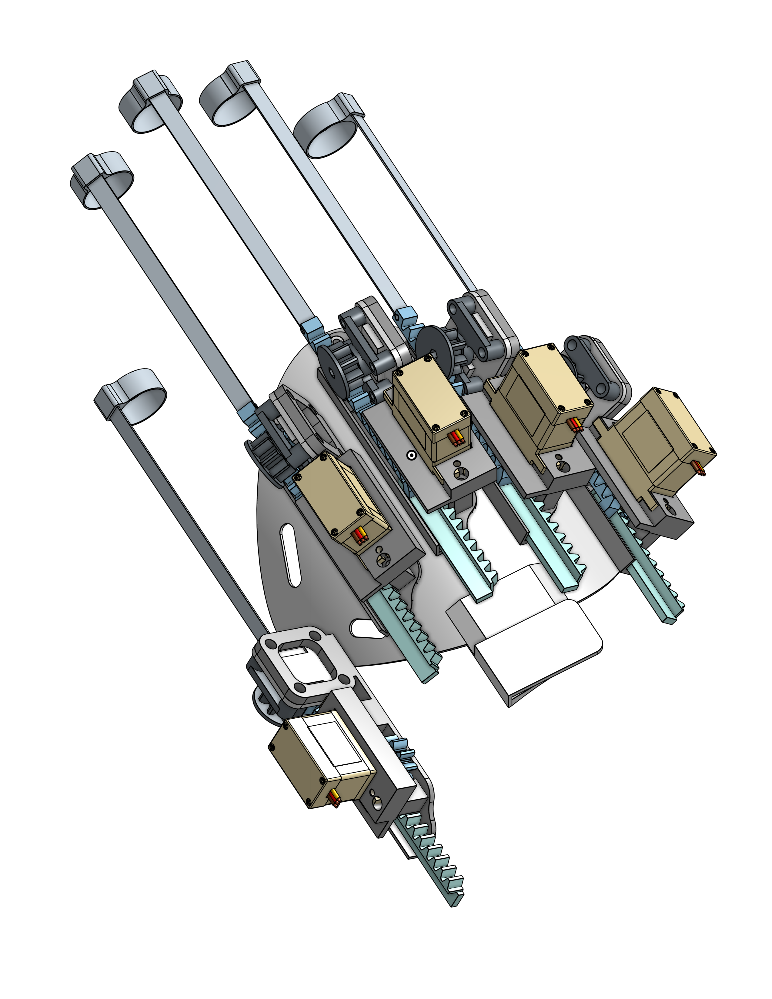
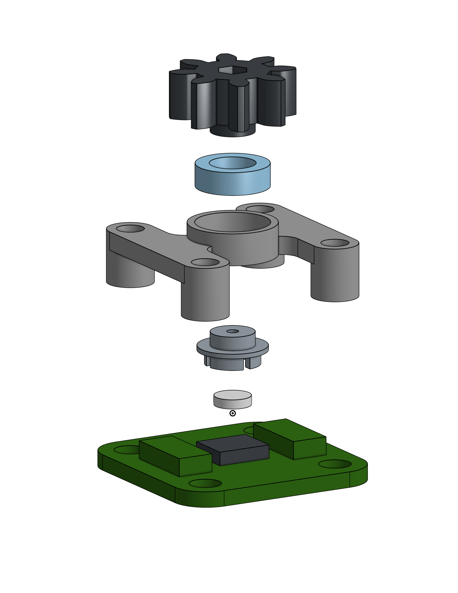
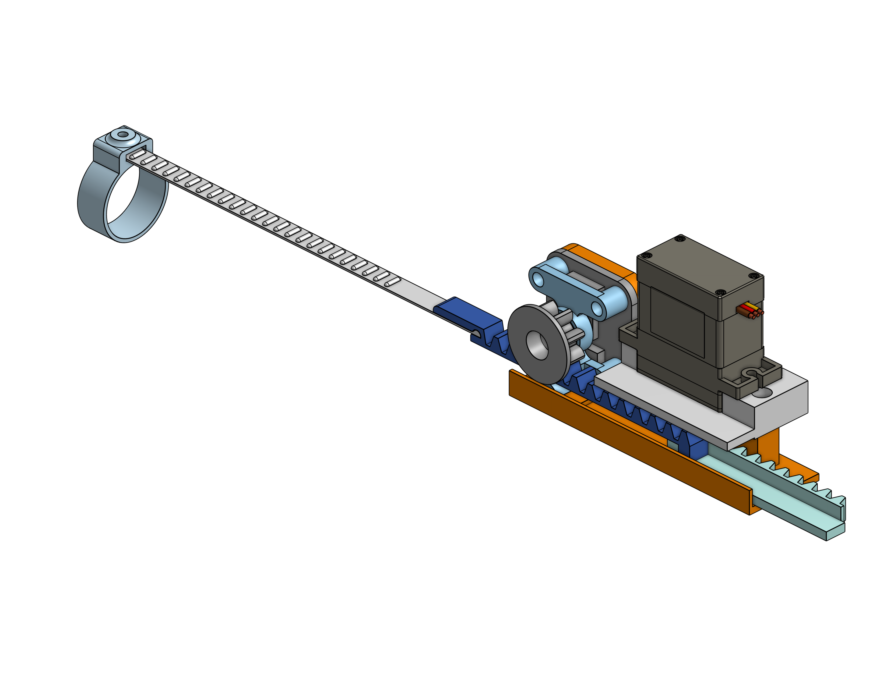

# ExoTouch-2.0

ExoTouch 2.0 - Firmware and 3D Printer Files
This repo contains the arduino firmware as well as the STEP files for prototype 1 ExoTouch 2.0. This is a finger tracking glove that allows you to use your hands in VR.

# Firmware
The firmware used is based on the LucidGloves project made by Lucas VRTech.
Open the firmware files located in the firmware/lucidgloves-firmware folder. By default the firmware is configured for an arduino nano using serial. To configure the firmware, change the defines in the lucidgloves-firmware.ino file.

- Configuration instructions are here: [Configuration Instructions](https://github.com/LucidVR/lucidgloves/wiki/Firmware-Setup-and-Customization-Tutorial).
- Firmware Troubleshooting Guide is here: [Firmware Troubleshooting Guide](https://github.com/LucidVR/lucidgloves/wiki/Firmware-Troubleshooting-Guide).

# Supported Communication Methods:
- USB Serial
- Bluetooth Serial (On ESP32 boards)

# Hardware

STEP files for 3D printing are located in the 3d-models folder.

The assembly for each hand is as follows:

- Exoskeleton (either leftie or rightie)
- Arduino Nano / ESP32 - 6€
- I2C Multiplexer - 9€

## Encoder module

- AS5600 encoder (x5) - 
- Rotor (5x)
- Rotor magnet (5x)
- Stator (5x)

## Base module

- MG90S micro Servomotor (x5) - 25€
- Base (5x)
- Finger flex (5x)
- Rack (5x)
- Servo fixture (5x)
- Leading rack (5x)
- Leading cog (5x)

- Finger ring (1x per finger, will need to select correct size to fit)

# SteamVR compatibility
This project uses the OpenGloves OpenVR driver for compatibility with SteamVR, which is downloadable on Steam:
https://store.steampowered.com/app/1574050/OpenGloves/

Source code available on GitHub:
https://github.com/LucidVR/opengloves-driver
